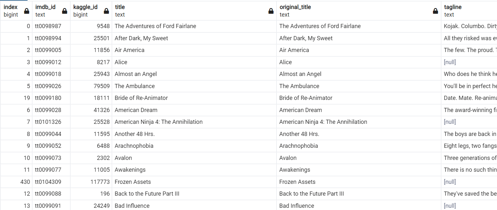

# Movies-ETL

Using a dummy dataset an automated pipeline was created that takes in new data, performs the appropriate transformations, and loads the data into existing tables.

One function was created that takes in the three files—Wikipedia data, Kaggle metadata, and the MovieLens rating data—and performs the ETL process by adding the data to a PostgreSQL database.

